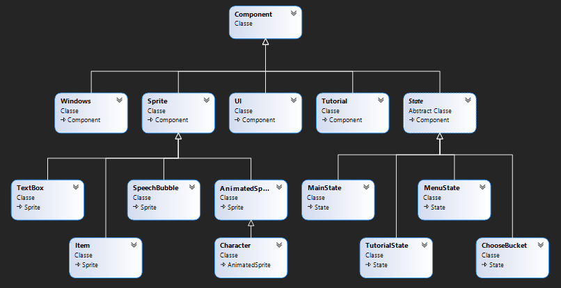
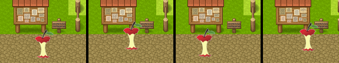
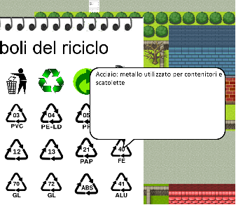
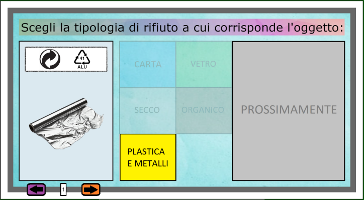
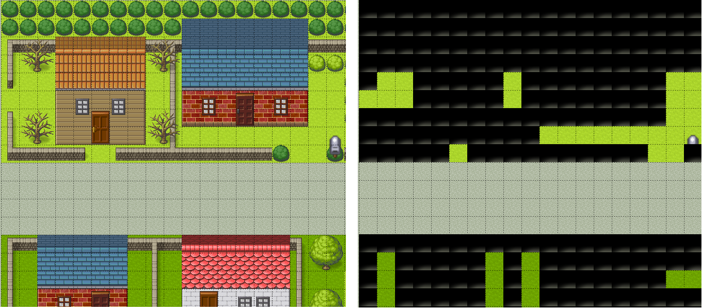
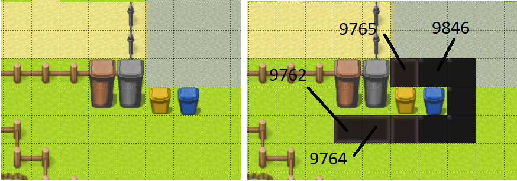

<b><h1>Recycle Game</h1></b>

A video game by Alessandro Maggi and Davide Orengo

*Computer graphics arch exam - games and simulation*

<b><h2>Targets</h2></b>

Create a game, in particular a serious game (game not only of entertainment but also educational), with the aim of sensitizing and teaching how separate waste, thus creating an educational, effective and pleasant experience for the player.

<b><h2>Introduction</h2></b>

The development of the project was carried out using the Monogame framework and Visual Studio taking advantage of the knowledge learned during the COMPUTER GRAPHICS ARCH.- GAMES AND SIMULATION course and deepening the concepts necessary for the realization.

The name of the game is "RecycleGame" as the topic is recycling.

This theme was chosen because waste disposal is an increasingly felt problem both by citizens and administrations, due to the incredible amount of garbage that modern society produces, consequently one of the main solutions is the recycling which thanks to the collectivity can bring significant benefits.

The game is aimed especially at children but also to anyone who wants to learn the basics of waste separation in such a way to apply the same approach in the real world. The game indicates to the player if he is correctly recycling the waste by providing various tools that indicate the progress of the game and also allows you to consult an information booklet for more details on European recycling.

The player can explore the external surroundings of a town using his character and can collect various waste that he finds and at any time he can go to a bin to deposit the waste of a specific type.

The game features a score that represents the player's experience and changes depending on the right or wrong choices in waste sorting. So if the action of depositing a waste in a specific bin is wrong, points will be removed instead if it is correct they will be added.

The game is divided into levels and each level is represented by a different score range, the first level provides the player with a limited number of types of waste and the corresponding bins, consequently the subsequent levels will unlock new types of waste and bins to interact with.

The interaction between waste and bins takes place through a game window that allows you to choose between the collected waste and which to throw in the corresponding bin.

<b><h2>MonoGame framework</b></h2>

Recycle Game was created using MonoGame, an open-source framework for cross-platform videogames: it allows videogames porting to many platforms including Windows, Linux, iOS and android. MonoGame allows the development of videogames by means of the C# object programming language by offering numerous classes that contain indispensable tools.

The structure of a game created with Monogame is essentially based on three classes:

-   *Game*: the heart of the videogame which is also the entry point of the program. It contains the interfaces of the essential methods for the game and called by the base class:

    -   *Inizialize()*: contains the basic initialization of the graphics and input sector;
    -   *LoadConten()*: upload multimedia content 
    -   *Update()*: method called before rendering of each frame. It takes as input a GameTime object used to get a lot of information about the game's time status
    -   *Draw()*: renders all the elements of the game on the screen. As Update(), it takes a GameTime object as argument
-   *Graphics.SpriteBatch*: allows the rendering of all Texture2D objects 
-   *Content.ContentManage*r: allows to manage all the multimedia resources of the game. For this purpose, the framework provides the Content Pipeline tool which, by means of a graphic interface, allows an easier management of the contents.

<b><h2>The structure of Recycle Game</b></h2>

Recycle Game was created using many different classes and often Inheritance and Polymorphism were used in order to manage numerous graphic objects with multiple behaviors and different interactions. Below is the diagram of the most significant classes of the videogame:

<b><h2>The main classes</b></h2>

***Component***: is the base class of the video game, contains the basic references that each component must have, namely ContentManager, GraphicsDeviceManager, Game. Almost all other classes derive from this class.

***State:*** game operation is based on state machine logic which is implemented within the Game1 class, the latter derived directly from Game. Each state inherit from the State class, Draw() and Update() methods which perform the same function as the homonymous methods contained in the Game1 class. The Game1 class contains two properties _currentState and _nextState which refer to the previous and next states. The first is changed in Game1's Update() method whenever the _nextState variable contains a new state of the game. The next state variable is changed within the same states whenever it is needed. In another paragraph of this report the individual states will be discussed.

***Game1***: derived from Game and so it is the entry-point class of the game. Contains game initializations, the state and level management. The Update() and Draw() methods of the MonoGame framework are implemented within it.

***Sprite***: an object of this class represents a single sprite whose properties are multiple among which the most important are:
    -   *texture*: the texture of the sprite
    -   *rect*: the rectangle in which the sprite is contained
    -   *gamePos*: position of the sprite in relation to the game map
    -   *displayPos*: position of the sprite relative to the screen
    -   *scale*: measure of texture scaling
    
The sprite class contains all the methods necessary to manage the movement and position of each single element:

-   setPos(), setGamePos(): change the position absolutely
-   stepPos(), stepGamePos(): change the position of a certain amount
-   setTilePos(): changes the position with reference to the tile map

It also has its respective get\#\#\#() methods that are used to get the values. Five other classes derive from this class. The sprite class contains a basic Draw() function which is often replaced by a more specific Draw() in derived classes.

***Animated Sprite***: award to each individual sprite an animation given by the succession of frames which are grouped in a single texture. The animation technique is based on showing only a portion of the texture in which the frame you want to view is present.

***Character***: derived from sprites, this class allows to create a character capable of moving in the game and interacting with the obstacles on the map. Each Character object can be manipulated from the keyboard with WASD commands thanks to the method keyboardMgnt present inside the MainState 

***Item***: this class allows to manage the individual objects in the game that represent waste like Sprite. Each Item has a type property that confers the type of waste starting from an enumerative list. Furthermore, thanks to a lookup table of the sine function, each item is able to move up and down giving an animated effect useful for identifying the presence of an item within the map.

***SpeechBubble***: creates a speech bubble containing any text that is displayed each time it is activated using an enable variable. This class is used inside the window where all the symbols of the recycling are located. Each time the mouse arrow passes over a symbol, a speechBubble is activated which contains its description. The speechBubble can also be used with a Character to give the idea that it is speaking.

***Vocabulary***: this class creates a window in the form of a notebook in the center of the screen which shows in sequence the recycling symbols with their descriptions, all the bins and all the objects present in the game. To move from one page to another, use the arrows located at the base of the notebook. The management of which pages to show is done through the use of delegates: the delegate that is called within the Draw() is modified within Update() by inserting a method that will show the correct page.

***Windows***: creates an interactive window that allows to interact with the waste that has been collected and the available bin.
To build the window, the Windows class was written which includes the Draw() and Update() methods and others in order to manage its interaction with the player. 
The window has a background texture on which various elements are positioned, on the left:

-   a "card" texture that includes the image of the waste and the specific symbols for that type of recycling;

NOTE: when there is no item, a default card appears with the words "no item".

-   a number, represented by the Banner class, shows the number of the "card" which is viewed (the sequence of cards follow the order of collection)
-   a right arrow and a left arrow both represented by the Button class which, when one is clicked, allows to switch from one card to another so you can reach the waste to be deposited in the available bin.

On the right there is a "puzzle" composed of squares with each the name of a type of waste, each square is represented by the Button class then there is also a texture of a box with the word "coming soon" which changes with respect to the level where the state of the game is found. The box indicates that in the next level new squares will be available for new types of waste.

The class has two outline textures, one green and one red, which will be shown by flashing instead of the white outline when the player deposits a waste, if the answer is correct, the green one appears instead of the red one.

To view the window, the player must position himself in front of a bin and press "space" on the keyboard so the enabling variable will be changed, this will be done using the tiles which will be discussed later. To exit the window, press the Esc key which in turn changes the enable.

Once the window is open it will be possible to press with the mouse only the square referring to that specific bin to deposit the displayed waste, instead the other squares will appear discolored and therefore it will not be possible to use them.

<b><h2>The states of the game</b></h2>

As already mentioned, the RecycleGame is structured as a state machine which are all objects of the State class and each one implements its own Draw() and Update() methods. The initial state is set inside the Game1 class in the LoadContent method and in the Draw and Update methods of Game1 the counterparts are called inside the _currentState.

***Input management***

Each state independently takes care of managing keyboard inputs using the KeyBoardState object which is passed as a parameter to the Update method within Game1. Each state, if necessary, implements a method called keyboardMgnt() which has the purpose of analyzing the KeyBoardState object and carrying out the necessary actions to make the game work.

***MenuState***:  is the first state of the game and aims to show the menu which includes three buttons:

-   *New Game*: brings the status to MainState namely starts the game 
-   *Load Game*:  is disabled button, but in the future it will aim to load a state of the game that has been saved previously
-   *Exit*:  call Exit() method of the Game class that closes the game

***MainState***: it is the main state of any videogame. Within it are generated:

-   the main character controlled by the user via the keyboard
-   all objects in the game that have to be differentiated
-   the game map

Within this state all interactions between the character and objects are managed through the event manager. The Draw() function shows the characters, the UI and all the current objects on the map. The Update() method not only deals with updating the position of the map and the character, it also positions objects randomly within the game in certain areas defined in the Tile matrix. Subsequently a paragraph will be dedicated to the explanation of how the above-mentioned matrices are managed.

***TutorialState e ChooseBucket***: they are two simple and very similar states, they deal with showing the objects of the Tutorial and Windows classes on the screen respectively. 

<b><h2>Tiled and the tile matrices</b></h2>

Tiled is a free and open source software that is used to create 2D video game maps using the tile technique. A tile is a square portion of a screen with a size typically 16x16px or 32x32px as in RecycleGame. Each tile is filled with a texture to compose a grid which represents the game map, called TileMap. Tiled allows the design of the map through overlapping tile layers. The only layer displayed, however, will be the one higher than the others. The TileMaps are saved in a .tmx file that contains all the layers in XML encoding containing in the form of two-dimensional arrays, rows and columns of the tilemap. Each element of the arrays is a number representing a precise 32x32px texture.

To use a map created with Tiled in monogame, simply export the map created in .png or .jpg format and then import the latter into the LoadContent. In the exported image, however, will be visible only the tile of layers that have been made visible.

In RecycleGame a method has been implemented to read the tilemap .tmx file and encode all the layers in two-dimensional lists. In this way, knowing that the map is a 32x32px grid, it is possible runtime to associate every single piece of the map to all the tiles for each layer. So you can create hidden layers that have the purpose of identifying particular areas of the map, such as obstacles.

To give an example, in the left figure there is a piece of the map visible in the game, in the right figure instead the same map but with the layer containing the obstacles that has been made visible.

When the Character moves within the map, he analyzes all the tiles he comes into contact with. Thanks to the hidden layers it is possible to understand if it is in front of an obstacle or not.

With the same technique, different interaction with other elements scattered throughout the game has been made possible: there is a layer that contains different tiles one for each bin on the map and in this way it is possible to make interacting the character differently based on the tile in which it is located. 

The map visible in the game is shown on the left while the layer containing the tiles with which the character interacts is visible on the right.

Other hidden layers have been created to identify particular areas of the map in which only a certain type of waste appears, such as plastic waste that appears only on the beach. 

<b><h2>Conclusions and future developments</b></h2>

The development of this game has been very important for the understanding and practice of creating 2D games using the C\# language and Monogame. The object-oriented programming has allowed us to improve our skills as a programmer using techniques such as polymorphism and inheritance.

Teamwork would not have been possible if we had not used the Git version control system (VCS). During the project we have made several changes and thanks to ever new ideas we have improved the game step by step.

Recycle Game can still be improved and expanded. We thought it would be interesting to implement a rescue system of game state to recover an interrupted game. Also, in order to broaden the perspectives of game, it may be useful to add new maps, new objects and the player's ability to use tools that allow more efficient recycling.
